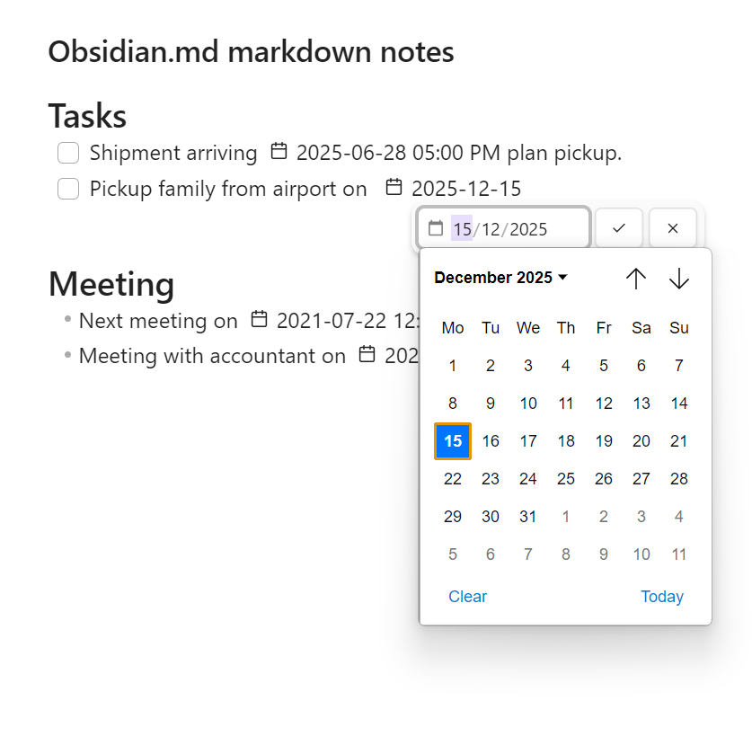

# Use a datepicker to edit and insert date and time anywhere in your markdown notes

- Can automatically show whenever a date is selected.
- Can add a calendar button to date values in your notes that can be selected to open a datepicker.
- Adds command to edit date.
- Adds commands to insert a new date or date and time.

For issues or bugs with the plugin, feature requests or suggestions, please open an issue.

 

Your support is welcome and appreciated!
