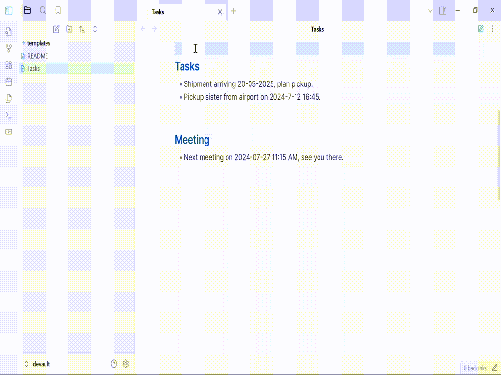
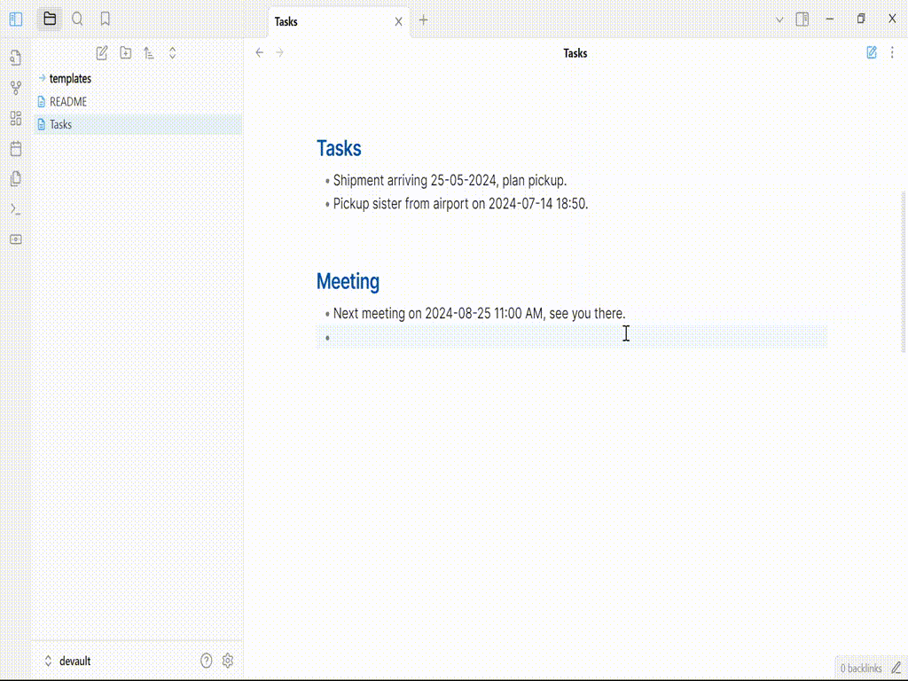

This plugin provides a date picker that shows when the editor cursor is placed on a date or date/time value in a markdown note.

You can also insert a new date or date and time using datepicker plugin.

For issues or bugs with the plugin, feature requests or suggestions, please open an issue.

Your support is welcome and apreciated!

